# AI DevSpace

> 本机运行的「AI 原生软件工程工作台」——以"需求"为工作单位，用文件系统统一管理多仓库、产物、知识与 AI 会话。AI 智能外包给 Claude Code SDK，平台只做"状态编排 + 上下文装配 + UI 协同"。

详细产品定义见 [`.scratch/ai-devspace-mvp/PRD.md`](.scratch/ai-devspace-mvp/PRD.md)，UI 打磨设计稿见
[`.scratch/ai-devspace-mvp/UI-POLISH-SPEC.md`](.scratch/ai-devspace-mvp/UI-POLISH-SPEC.md)，架构决策见 [`docs/adr/`](docs/adr/)。

## 项目简介

AI DevSpace 是一个 pnpm + Turborepo 管理的 monorepo，由以下子包组成：

| 子包                | 角色                                                 | 端口   | 状态               | 技术栈                                                      |
| ------------------- | ---------------------------------------------------- | ------ | ------------------ | ----------------------------------------------------------- |
| `apps/web`          | Web 工作台（UI、交互、状态镜像）                     | `3333` | 已可启动           | Next.js 14 (App Router) · TypeScript · Tailwind · shadcn/ui |
| `apps/agent`        | 本机 Agent 守护进程（SDK 调度、FS、git、Skill 加载） | `7777` | 骨架已落地         | Node.js 20 · TypeScript · Fastify v5                        |
| `packages/shared`   | 跨端共享类型（SSE 事件、REST 契约、状态枚举）        | —      | 已实装             | TypeScript + zod                                            |
| `packages/scripts`  | 保活脚本（start/stop/watch/status）                  | —      | 已实装             | Bash 4+                                                     |

Web 与 Agent 通过 localhost 上的 **HTTP REST + SSE** 通信：客户端 → Agent 走 REST，Agent → 客户端走 SSE
长连推送 AI 输出 / 状态变更 / 错误。issue 03 已落地鉴权（动态 Token + Origin 校验 + 公开 bootstrap 端点）。

## 目录结构

```
.
├── apps/
│   ├── web/                # Next.js 14 Web 工作台（端口 3333）
│   └── agent/              # Fastify 守护进程（端口 7777）
├── packages/
│   └── shared/             # 跨端共享类型（SSE 事件、REST 契约、状态枚举）
├── docs/
│   ├── adr/                # 架构决策记录
│   ├── design/             # 设计相关文档
│   └── superpowers/        # 计划与规范
├── .scratch/
│   └── ai-devspace-mvp/    # 产品 PRD、设计稿、issue 与 ADR 草稿
├── turbo.json              # Turborepo 任务编排
├── pnpm-workspace.yaml     # pnpm workspace 定义
├── tsconfig.base.json      # 共享 TypeScript 配置
├── eslint.config.js        # 顶层 ESLint flat config（v9）
├── .prettierrc             # Prettier 配置
├── .editorconfig           # 编辑器基础风格（LF / UTF-8 / 2 空格）
└── package.json            # 根脚本与 devDeps
```

## 启动方式

环境要求：**Node.js ≥ 20**、**pnpm ≥ 9**。

```bash
# 1. 安装依赖（首次或依赖变更后）
pnpm install

# 2. 同时启动 Web（3333）和 Agent（7777）
pnpm dev
```

`pnpm dev` 同时拉起两个进程（用 `pnpm -r --parallel --filter=./apps/*`），输出会交错。只想跑单个：

```bash
pnpm dev:web     # 仅 Web（端口 3333）
pnpm dev:agent   # 仅 Agent（端口 7777）
```

启动后访问 `http://localhost:3333`。Agent 健康检查：

```bash
curl http://localhost:7777/api/health
# → {"ok":true,"name":"agent"}
```

## 测试与构建命令

| 命令                | 说明                                                    |
| ------------------- | ------------------------------------------------------- |
| `pnpm typecheck`    | 跨所有 workspace 跑 `tsc --noEmit`（由 Turborepo 编排） |
| `pnpm test`         | 跨所有 workspace 跑测试（agent 用 vitest）              |
| `pnpm build`        | 跨所有 workspace 构建产物                               |
| `pnpm lint`         | 跨所有 workspace 跑 ESLint（顶层 flat config）          |
| `pnpm format`       | 用 Prettier 格式化仓库内可解析文件                      |
| `pnpm format:check` | 仅检查不写入（CI 友好）                                 |

## Agent 守护进程（issue 03）

`apps/agent` 是本地守护进程，监听 `:7777`，提供 REST + SSE + Cookie 鉴权。

| 命令              | 作用                                          |
| ----------------- | --------------------------------------------- |
| `pnpm agent:start` | nohup 后台拉起 + 5s 探端口                    |
| `pnpm agent:stop`  | 优雅停（TERM → 5s → KILL）                    |
| `pnpm agent:watch` | 常驻 5s 轮询，进程消失自动重拉                |
| `pnpm agent:status` | 看 PID 活否                                  |
| `pnpm dev:agent`   | dev 模式（tsx watch 热重载，不跑 watcher）    |

环境变量：

- `AIDEVSPACE_HOME` 默认 `~/.aidevspace`
- `AGENT_LOG_FILE` 默认 `$AIDEVSPACE_HOME/logs/agent.log`
- `PORT` 默认 `7777`

快速验证 Agent 起来了：

```bash
pnpm agent:start && sleep 3
TOK=$(curl -s http://localhost:7777/api/agent/bootstrap | python3 -c 'import sys, json; print(json.load(sys.stdin)["token"])')
curl -sN -H "X-AIDevSpace-Token: $TOK" http://localhost:7777/api/requirement/REFUND-001/events | head -5
pnpm agent:stop
```

### 平台支持

- **macOS / Linux**：脚本 `set -euo pipefail`，Bash 4+。macOS 默认 bash 3.2 不满足，建议 `brew install bash`。
- **Windows 不支持**（本期未提供 PowerShell 脚本；WSL 用户可走同套 sh）。

## 当前进度

按 issue 顺序落地，地基阶段（`apps/*` 骨架 + monorepo 工具链 + agent 骨架）见
[`.scratch/ai-devspace-mvp/issues/`](.scratch/ai-devspace-mvp/issues/)。

本次变更合并 issue 01 + issue 02 + issue 03：

- 新建 `apps/agent/`：Fastify v5 + auth + SSE 通道 + 5x requirement 501 routes + `/api/agent/bootstrap` + health + pino dual-sink
- 顶层 root scripts 加 `agent:start/stop/watch/status`
- 保活脚本：`packages/scripts/agent-{start,stop,watch,status}.sh`
- 共享 schema：`packages/shared/src/{sse,api}.ts`（Zod）
- 设计 spec：`docs/superpowers/specs/2026-07-12-agent-skeleton-design.md`
- 实施 plan：`docs/superpowers/plans/2026-07-12-agent-skeleton.md`
- 顶层 README

后续 issue（Agent SSE / workspace 初始化 / 需求 CRUD / 仓库 worktree / AI 对话面板 / 内置 Skill 等）按
PRD §11 实施路线推进。

## 产品介绍

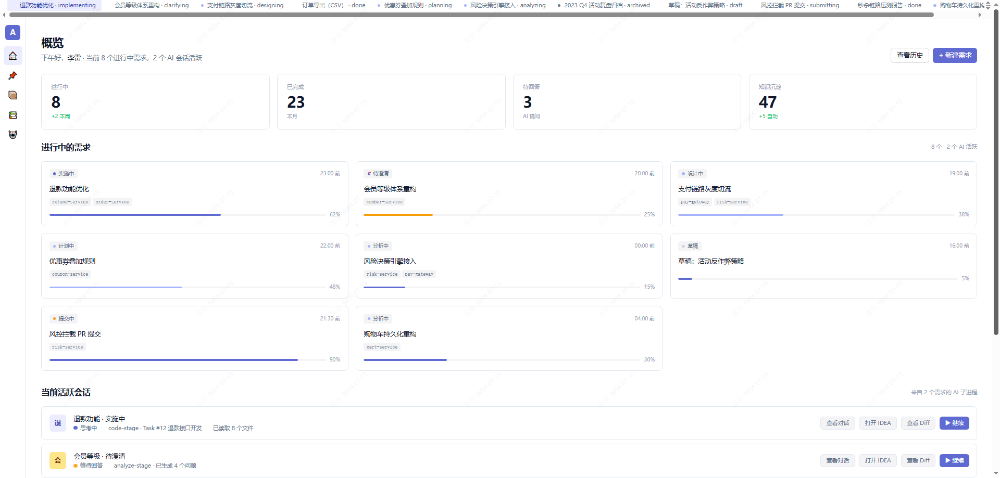
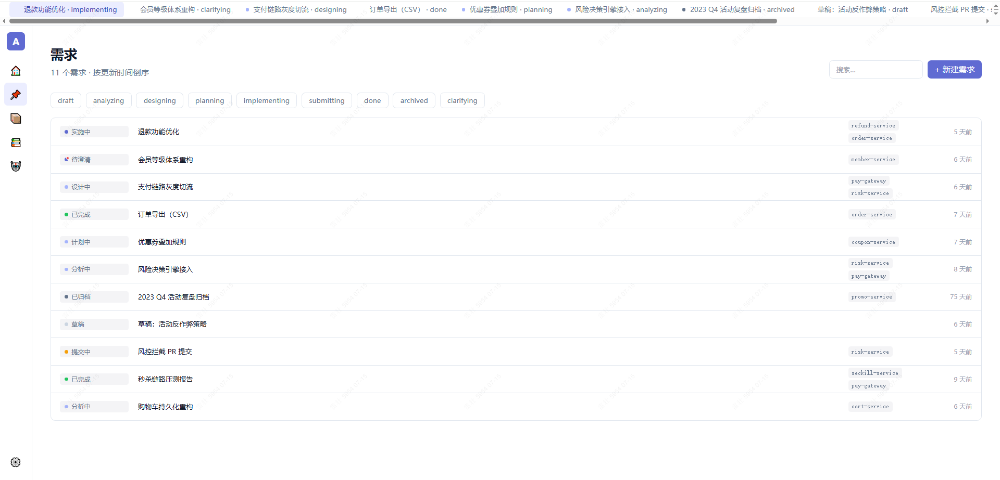
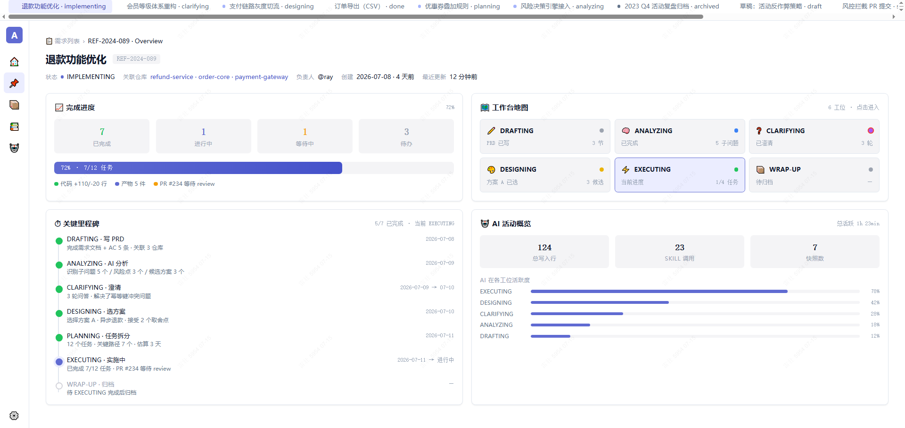
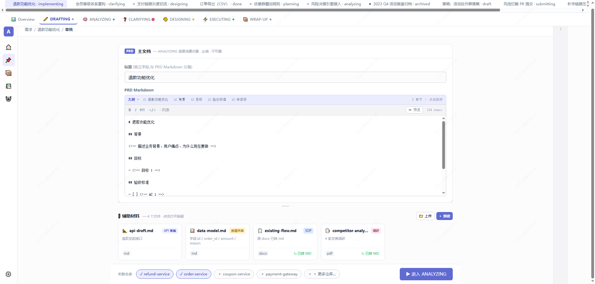
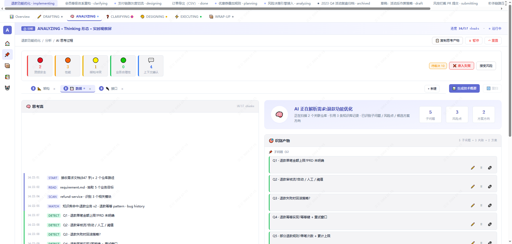
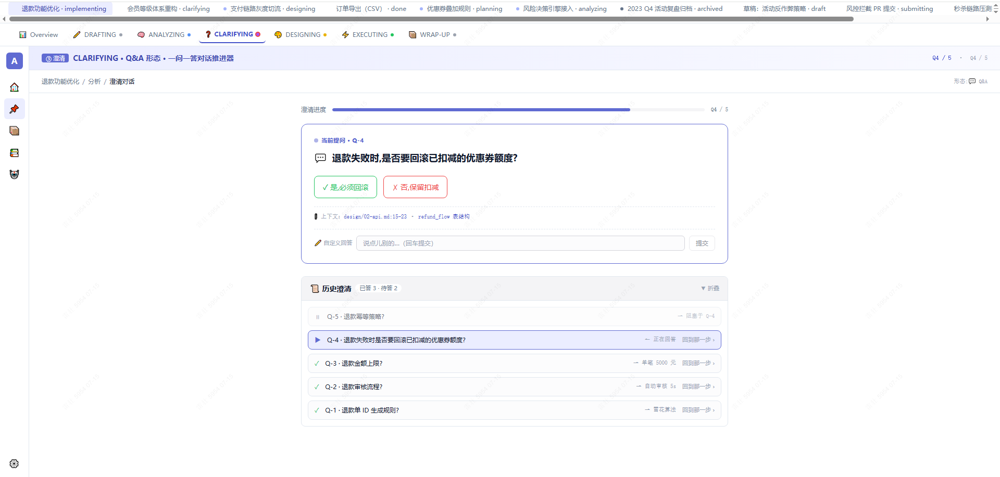
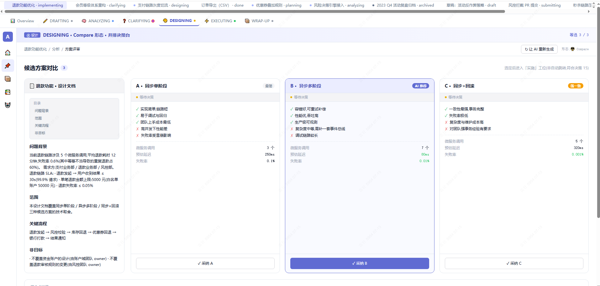
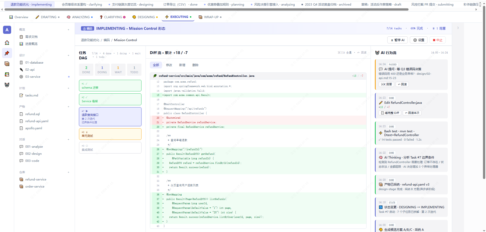
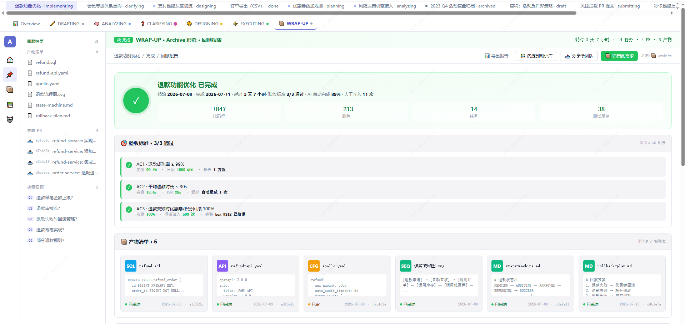
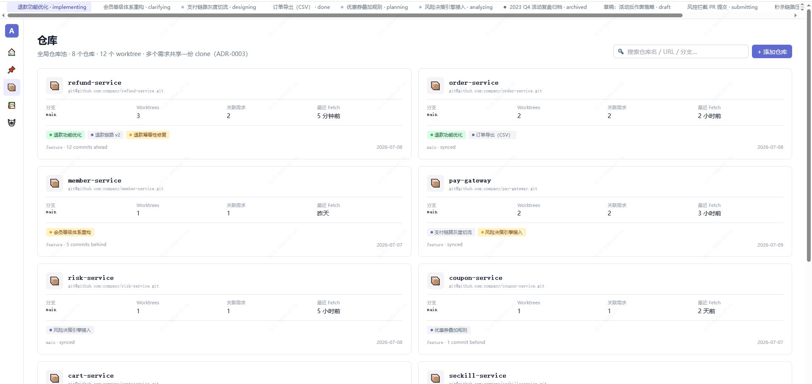
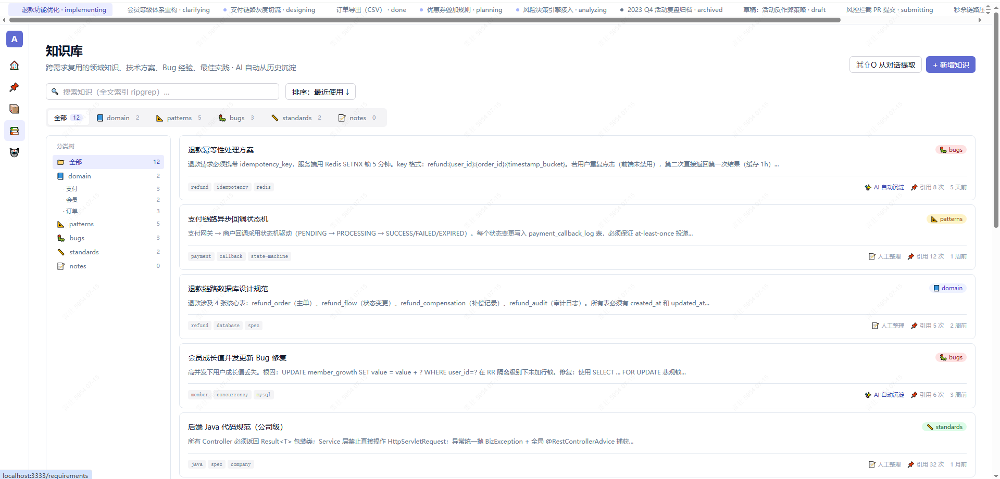
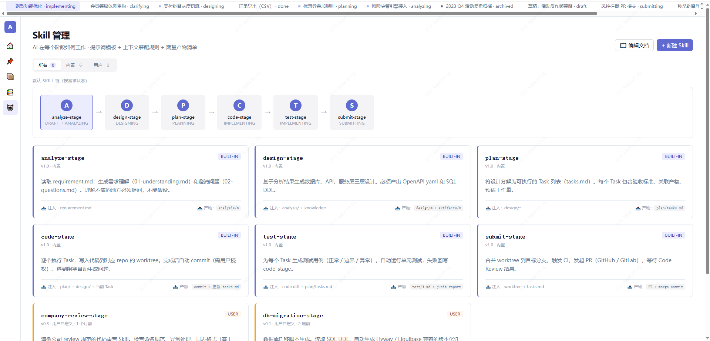

## 许可

MIT License。
