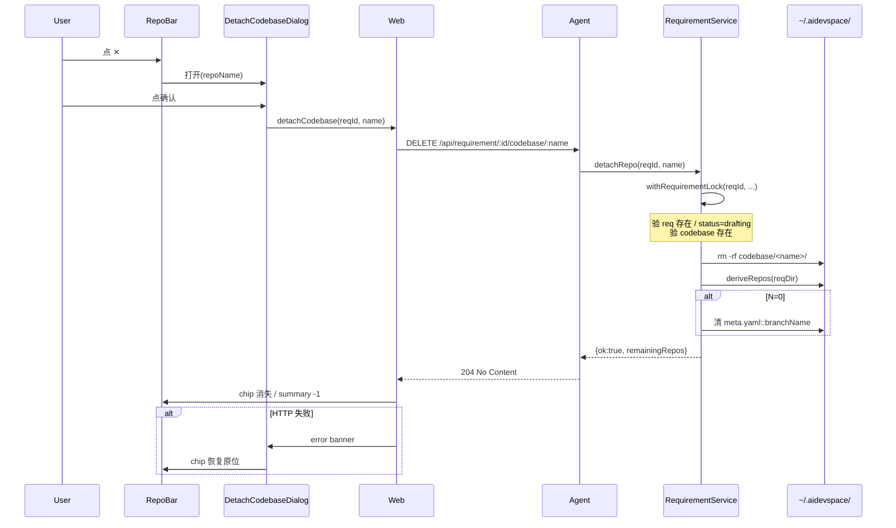

# ADR-0034: 需求级 codebase detach(取消关联仓库 = rm 目录)

**Status:** Accepted
**Date:** 2026-08-16
**Deciders:** 项目负责人
**Implements:** `.scratch/codebase-detach/issues/01-detach-repo-from-requirement.md`
**关联 ADR:** [ADR-0030](0030-repo-registry-and-per-requirement-clone.md) D5 / [ADR-0033](0033-incremental-attach-repos.md) / 决策 113

---

## Context

DRAFTING 页面 RepoBar 展开态 chip 上的红色 ✕ 按钮(见用户截图)目前只更新前端 React state:

- [apps/web/src/components/repo-bar.tsx:425-443](apps/web/src/components/repo-bar.tsx#L425-L443) `onClick={() => handleDetach(repo.name)}`
- [apps/web/src/components/drafting-zone.tsx:678-681](apps/web/src/components/drafting-zone.tsx#L678-L681) `setSelectedRepoNames(prev => prev.filter(...))`

后端从未收到请求,`requirements/<reqId>/codebase/<repoName>/` 目录、`meta.yaml::branchName` 引用、`repos.yaml` 全局条目全部保留。重启 agent 后 `deriveRepos` 仍会列出该 repo,「取消关联」只是 UI 错觉。

### 问题

1. 用户点了 ✕ 以为已取消关联,但下次进 DRAFTING chip 又出现(SSR 数据从 fs 派生)
2. 磁盘上的 codebase 目录一直堆积(多次「以为」detach 后,clone 残留不清)
3. attach 失败的回退路径不可逆 —— 想换个干净仓库重试,只能保留原 codebase

### 用户原始诉求

> 增加取消关联仓库功能,触发节点:RepoBar 上某仓库 chip 的红色 ✕ 按钮。预期结果:codebase/ 目录下删除对应仓库。

---

## Decision

10 条 grill-with-docs 共识(详情见 [`.scratch/codebase-detach/decisions.md`](../.scratch/codebase-detach/decisions.md)):

### 1. 删除范围 = rm 目录 + (N=1→0 时清 branchName)

`requirements/<reqId>/codebase/<repoName>/` 目录被 `CodebaseManager.remove`(已存在)清理。`meta.yaml::branchName` 是 **per-requirement** 字段(所有 repo 共享),**只在 N=1→0 时清** —— 其他 repo 还在时,branchName 必须保留以维持 chip 上的 🟢 + 分支名显示。`repos.yaml` 全局条目**永远不动**(决策 113 沿用,与 `DELETE /api/repos/:name` 严格独立)。

### 2. 状态门禁 = 去掉(任何状态都可 detach)

API 层不校验 `requirement.status`。ANALYZING / BOARD / WRAP-UP 期间也可 detach。

**历史**:第一版曾设"仅 DRAFTING 可 detach",后端 409 `E_REQUIREMENT_NOT_DRAFTING`。理由是"分析期间 codebase 正在被读,静默切库不安全"。

**现状**(2026-08-17 翻案):实际用户场景里,需求已 analyzing / board 才发现自己 attach 了错的库 —— 这时唯一能"重来"的路径就是 detach + 重 attach。门禁把这条修复路径堵死了。"真要切应先停止分析"理论上对,但产品没暴露"停止分析"动作给用户,等价于"让用户去找 agent 维护者手动改文件"。

**取舍**:ANALYZING / BOARD 期间 rm codebase 目录,Agent 进程内的分析子任务可能在 stale path 上跑 —— 但分析任务是短命的(一次 analyze run 几秒到几分钟),且分析结果只影响后续步骤的状态机,丢失本次结果不会让 req 崩。Detach 是破坏性操作,二次确认对话框(决策 Q3)仍是兜底。

### 3. 二次确认 = 弹确认框

旧版 ✕ 注释里写「可逆,重新 attach 即可」—— 加 rm 后**不再可逆**(重 attach = 重 clone)。沿用旧 UX 等于把数据丢失风险悄悄塞进产品,弹确认框(文案明确警告本地改动丢失)给最后一道闸。

### 4. 端点 = `DELETE /api/requirement/:id/codebase/:name`

与 `DELETE /api/repos/:name` 一对平行端点,**全局仓库池删除 vs 需求级 detach** 语义对称。`codebase/` 命名直接对应文件系统路径,避免 `repos/` 与 repos.yaml 命名混淆。

路由层 3 个错误码映射(决策 §2 翻案后去掉 `E_REQUIREMENT_NOT_DRAFTING`):

- `E_REQUIREMENT_NOT_FOUND` / `E_CODEBASE_NOT_FOUND` → 404
- `E_INVALID_REPO_NAME`(`/`, `\`, `..`, `\0`)→ 400
- `E_INTERNAL`(safeRm throw)→ 500

### 5. 并发保护 = per-requirement mutex

`RequirementService` 新增 `withRequirementLock(reqId, fn)`(同 `WorkspaceService.registryLock` 模式)。**锁覆盖范围: `attachRepo` / `attachRepos` / `detachRepo` 三个入口**——Plan agent §7.1 显式指出若 attach 不加锁,detach + attach 同 req 并发会引发 fs 状态机错位(刚 attach 完就被 detach 等)。**实现细节**:`attachRepos` 内部循环调用 `_attachRepoInner`(无锁),公共 `attachRepo` 才包锁,避免双重 acquire 死锁。

### 6. 写盘顺序 = rm 先,再 meta.yaml(Q7)

rm 失败 → throw,不动 meta.yaml,UI 报错可重试。rm 成功 + meta.yaml 写失败 → branchName 残留是**纯字段脏**,下次 attach 会用新 branchName 覆盖空字符串,无副作用。

### 7. UI 策略 = 悲观更新(Q8)

确认 → chip 显示 spinner + disabled → HTTP DELETE → 成功 chip 消失,失败 chip 恢复原位 + error banner。不做乐观移除,rollback 复杂度不值得。

### 8. 测试 = service 单测 + route fastify.inject 集成 + 真 fs(不真 clone)

`apps/agent/src/__tests__/requirement-detach-codebase.test.ts`(17 用例,7 service + 10 route)。镜像 `requirement.test.ts:1-93` 的 fixture 模板,真 fs + fake git,不走真 clone(网络/CI 依赖过重)。前端 `DetachCodebaseDialog.test.tsx`(11 用例)+ `repo-bar.test.tsx` 24 用例适配 + `drafting-zone.test.tsx` 3 个 issue 09 测试适配 dialog 流程。

### 9. 文档 = ADR-0034 + .scratch/codebase-detach/ + domain.md 术语

`.scratch/codebase-detach/{PRD,decisions,issues/01-*.md}` 镜像 `.scratch/repo-registry-clone/` 结构。`docs/agents/domain.md` 追加 3 条术语:per-requirement codebase / detach / per-requirement mutex。

---

## Consequences

### 正面

- 用户的「✕ = 取消关联」心智模型终于与 fs 真实状态对齐
- detach 后重 attach 命中 `E_REPO_ALREADY_ATTACHED`(决策 109)路径可预测 —— 之前的「以为 detach」会让用户在「莫名其妙重复 attach」时困惑
- per-requirement mutex 顺带为 `attachRepo` 加锁,根除 detach + attach 并发 race(Plan agent §7.1)
- ADR-0030 D5「repos.yaml 与 codebase/ 解耦」沿用,本功能不破坏既有架构

### 代价

**新增工作量**:必须给 `attachRepo` / `attachRepos` 同步加锁(Plan agent §7.1),否则 detach + attach 并发会破坏 fs 状态机一致性。这超出原"只加 detach 端点"的最小范围,但属于「detach 的不可分割前置」,已合入本 ADR。

**commit 体积**:7 新文件 + 6 修改 + 17 集成测试 + 11 dialog 测试 + 4 drafting-zone 测试适配。

**跨进程并发仍未防**:与 `WorkspaceService.mutateRegistry` 一样,本期 per-requirement mutex 是进程内串行化。多 agent 实例 / 多进程同 req 并发仍可能出现 race —— DRAFTING 是单用户单进程场景,暂不引入进程间锁(留给后续 issue)。

**`..` 路径穿越测试无法在 HTTP 层验证**:Fastify(find-my-way)在路由层 URL 规范化时先吃掉 `..`,返 404 而非 400。这是 Fastify 自身的路径穿越防御,与 handler 内的 `..` 校验是双层防御;handler 校验仍覆盖 service-direct 调用路径。

### 兼容性

- `repos.yaml` 不动 → 与 `DELETE /api/repos/:name` 严格独立
- 其他状态(ANALYZING / BOARD / WRAP-UP)的 ✕ 入口未触 → 旧 UI 行为不变
- 旧 `onDetachRepo` prop 保留并标 `@deprecated`,fallback 兼容 WRAP-UP 等可能复用纯前端清理语义的特殊阶段
- 半成品 `.pending-<name>` 标记由 `CodebaseManager.remove` 内部一并清,与启动期 `scanOrphanedPending` 一致

---

## Alternatives Considered

### A. 即时删除(无确认,决策 Q3 a)

沿用旧 UX,点 ✕ 立刻 rm。代价:误点即数据丢失,无后悔药。原「可逆」前提已不成立,放弃。

### B. 智能确认(决策 Q3 c)

探 git status 判 codebase 是否干净,干净就即时删,脏就弹确认。看起来聪明,但 `safeRm` / git 损坏 / pending 状态等边界多,Issue 16 之前项目已经踩过 git 子系统不少坑。复杂度不划算,放弃。

### C. 软删除 + 撤销 toast(决策 Q3 d)

立刻删,5 秒 toast 内点撤销就恢复。实现成本高(5 秒内 cache 整个 codebase),对大 codebase 不现实,放弃。

### D. 不加 per-requirement lock(决策 Q5 a)

只给 detachRepo 加锁,不动 attachRepo / attachRepos。Plan agent §7.1 明确指出 detach + attach 并发 race。放弃。

### E. detachRepo 走 `POST /api/requirement/:id/detach-repo` body `{repoName}`(决策 Q6 b)

RPC 风格。破坏性操作更适合 DELETE 动词,与现有 `DELETE /api/repos/:name` 也不对称。放弃。

---

## 引用

- **ADR-0030 D5**: 仓库池 vs 需求级 clone 解耦(本 ADR 沿用)
- **ADR-0033**: 增量 attach(attach 镜像对称对象)
- **决策 113**: repos.yaml 与 codebase/ 解耦(本 ADR 沿用)
- **决策 109**: `E_REPO_ALREADY_ATTACHED` 幂等校验
- **Issue 13**: safeRm fd 竞争 retry + throw 语义(本 ADR 错误传播依赖)
- **Issue 16**: clone race 治本(本 ADR 锁覆盖范围参考其网络层 race 教训)
- **CLAUDE.md ADR-0023 守门精神**:本功能非 MCP 改动,不强制 e2e 测试;但走同等精神 —— 破坏性操作有 service + route 集成测试覆盖

---

## 流程图


